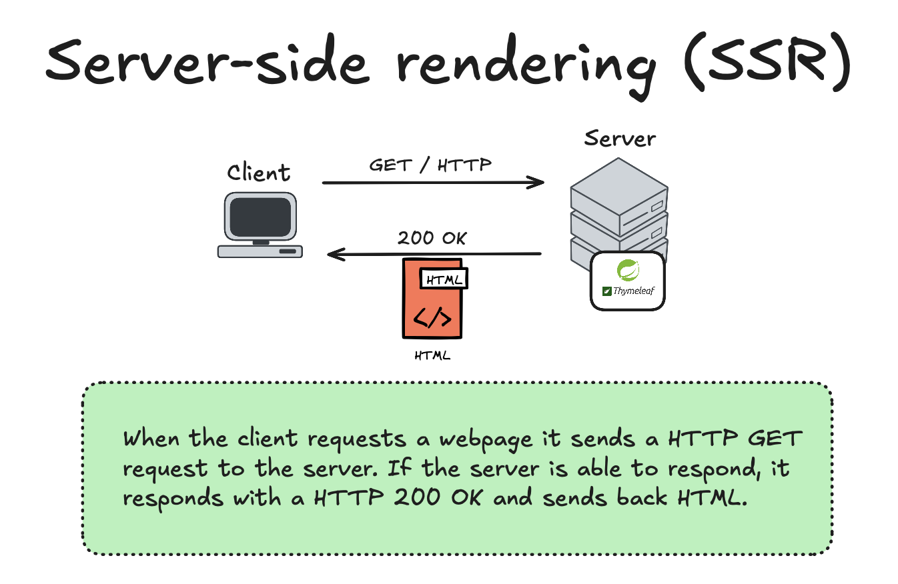
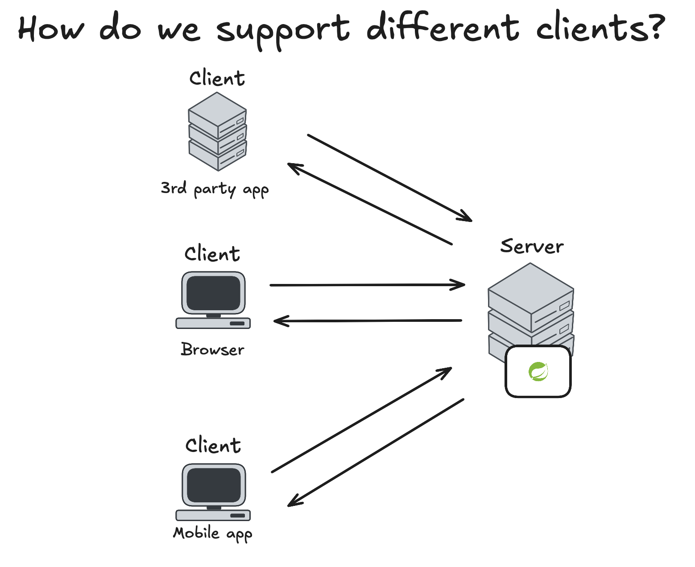
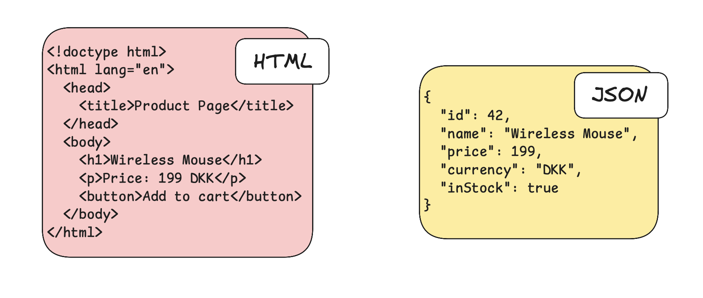
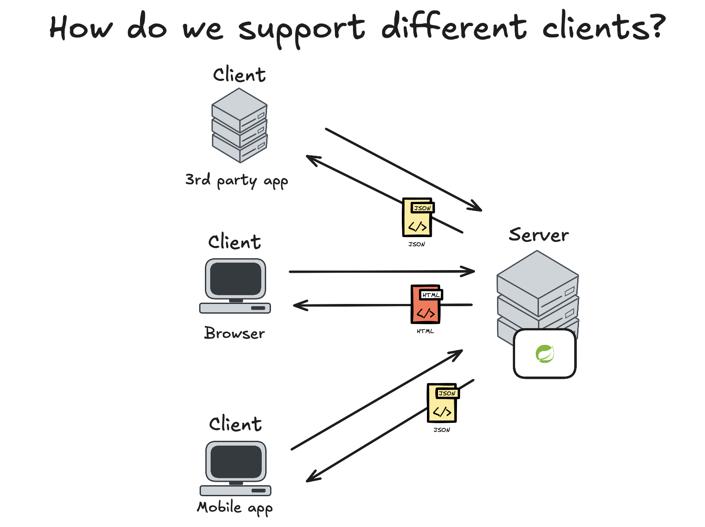

<!-- _class: lead -->

# REST APIs using Spring Boot  
### 3rd semester @ Erhvervsakademi København

<style>
section.lead h1 {
  text-align: center;
  font-size: 2.5em;
}
section.lead h3 {
  text-align: center;
  opacity: 0.6;
}
</style>

---
# Outline

- Recap of second semester
- Introduction to REST APIs
- REST API design principles
- Building REST APIs with Spring Boot

---

## What you should know so far
- Fundamental Java programming
- Full stack web apps with Spring Boot, Thymeleaf and MySQL (using `JdbcTemplate`)
- OOP design
- Test: unit tests (incl. mocking), integration tests
- Java Interfaces
- Using Git and GitHub (terminal or IntelliJ)
- Spring boot annotations like `@Controller`, `@Service`, `@Repository` etc.
- `@Bean` annotation?
- Dependency injection
- Ability to deploy an application to Azure

---

## Typical 2nd semester project structure

```bash
com.example.demo
 ├── DemoApplication.java
 ├── controller
 │    └── HomeController.java
 ├── model
 │    └── Todo.java
 ├── repository
 │    └── TodoRepository.java
 └── service
      └── TodoService.java
```

---

## Controller layer

Accepts **HTTP requests** from clients (browsers), interacts with the service layer, and **returns views (HTML) to the client**.

```java
@Controller
public class HomeController {
    private final SomeService someService;

    @GetMapping("/")
    public String home(Model model) {
        model.addAttribute("todos", someService.getAll());
        return "home";
    }
}
```

---

<!-- _class: img-80 -->


<style>
  section.img-80 img {
    max-width: 80%;
    height: auto;
    display: block;
    margin: 0 auto;
  }
</style>

---

<!-- _class: img-65 -->


<style>
  section.img-65 img {
    max-width: 65%;
    height: auto;
    display: block;
    margin: 0 auto;
  }
</style>

---

# With multiple different clients

### We only want to expose data (not HTML views)




---

<!-- _class: img-65 -->


<style>
  section.img-65 img {
    max-width: 65%;
    height: auto;
    display: block;
    margin: 0 auto;
  }
</style>

---

# What is an API?

- **API** = **A**pplication **P**rogramming **I**nterface
- A set of rules that allows programs to talk to each other
- It is an **abstraction** that allows the user to interact with a system without needing to understand its internal workings
- Can be used to access data or functionality of a service
- Can be local (within the same application) or remote (over the internet)

---

# What is REST?

- **REST** = Representational State Transfer
- Architectural standard for designing **networked applications**
- Based on **HTTP**, using standard methods:
  - `GET`, `POST`, `PUT`, `DELETE`, etc.
- Works with **resources**, typically represented as **JSON**
- **Stateless**: Each request from client to server **must contain all the information** needed to understand and process the request, i.e., **no session state** is stored on the server.
- **Uniform Interface**: A uniform way to interact with **resources**, simplifying the architecture and **decoupling client and server**.

---

# RESTful APIs

> An API that follows REST principles is called a **RESTful API**
- Uses standard **HTTP methods** to interact with resources
- Returns data usually as **JSON**
- Allows different systems to exchange data in a **standardized way**
- Can be **consumed by any client** (browser, mobile app, etc.)
- **Examples:** [GitHub API](https://api.github.com/users?since=76908022), [REMA1000 API](https://api.digital.rema1000.dk/api/v3/products), [ipinfo API](https://ipinfo.io/json) etc.

---

# Key Principles

- **Stateless**  
  Each request contains all info needed (no client session on server)

- **Client-Server**  
  Separation of concerns between frontend and backend

- **Uniform Interface**  
  Standard **HTTP** methods: `GET`, `POST`, `PUT`, `DELETE`

- **Resource-Based**  
  Resources are identified by URIs (e.g., `/users`, `/todos`)

---

# REST is Resource-Based

- A **resource** is an object or entity (e.g., user, todo, book)
- Resources are represented as **nouns**, not actions (verbs)

- **Good:**  
  `/users`, `/todos/5`, `/products/13`

- **Avoid:**  
  `/getUser`, `/createTodo`, `/updateProduct`

---

# Naming Conventions

- Use **plural nouns** for resource names  
  → `/todos`, `/users`, `/books`

- Use **lowercase** and **hyphens for readability**  
  → `/order-items`, not `/orderItems`

- Use **sub-resources** for hierarchy  
  → `/orders/42/order-items`, `/books/5/reviews`

- No verbs in path — actions are determined by **HTTP method**

---

## Idempotency in RESTful APIs

> If an operation is performed multiple times, and has the same effect, it is considered **idempotent**.

- **Examples:**
  - `GET /users/1` - Idempotent (retrieving same resource)
  - `PUT /users/1` - Idempotent (updating user to same state)
  - `DELETE /users/1` - Idempotent (deleting same resource)
  - `POST /users` - **Not idempotent** (creates new resource each time)

---

## REST APIs returns data, typically in JSON format

> **JSON:** Key-value pairs, easy to read and write for humans and machines

**Example**
`GET /todos/1`

```json
{
  "id": 1,
  "title": "Learn REST APIs",
  "completed": false
}
```

---

## JSON (JavaScript Object Notation)

Can represent complex data structures:
```json
{
    "id": 1,
    "name": "John Doe",
    "isActive": true,
    "roles": ["admin", "user"],
    "address": {
        "street": "Guldbergsgade 29",
        "city": "Copenhagen",
        "zip": "2200"
    }
}
```
> **Supports data types:** `strings`, `numbers`, `booleans`, `arrays`, `objects`

---

# Creating a Simple REST API

**`HelloController.java`**
```java
@RestController // Makes it return data not views
@RequestMapping("/api") // Base URL for this controller
public class HelloController {

    @GetMapping("/hello")
    public String sayHello() {
        return "Hello, World!";
    }
}
```
---

# Serializing Java Objects to JSON

> Spring Boot automatically converts Java objects to JSON using Jackson library

**If the controller returns a Java object or collection, it will be serialized to JSON, given the appropriate getters are present.**


---

<!-- _class: lead -->
# LIVE DEMO

---

## Pathvariables and request (query) Parameters

> A **path variable** is a variable part of the URL path, used to identify a specific resource like an ID.

**Example:**
- `/users/1` where `1` is a path variable.

> A **request parameter** (or query parameter) is a key-value pair appended to the URL after a `?`, used to filter or modify the request.

**Example:**
- `/users?role=admin` where `role=admin` is a request parameter.

---

## Pathvariables and request (query) Parameters

```java
@RestController
@RequestMapping("/api")
public class UserController {
    @GetMapping("/users/{id}")
    public User getUserById(@PathVariable Long id) {
        // Fetch user by id
    }

    @GetMapping("/users")
    public List<User> getUsersByRole(@RequestParam(required = false) String role) {
        // Fetch users by role if provided
    }
}
```

---

<!-- _class: lead -->
# LIVE DEMO

---

# Several approaches to test REST API endpoints
**Manual testing:**
- Postman
- cURL from terminal
- `.http` files in IntelliJ

**Integration testing:**
- Slice testing with `@WebMvcTest` and `MockMvc`
- Slice testing with `@WebMvcTest` and `MockMvcTester` (a wrapper around `MockMvc`)

---

# Testing the web layer using `MockMvcTester`

```java
@WebMvcTest(HelloController.class)
class HelloControllerTest {
    @Autowired
    private MockMvcTester mockMvc;

    @Test
    void testSayHello() {
        var request = mockMvc.get()
                .uri("/api/hello");
        
        assertThat(request)
                .hasStatus(HttpStatus.OK)
                .bodyJson()
                .convertTo(HelloMessage.class)
                .satisfies(msg -> {
                    assertThat(msg.getMessage()).isEqualTo("Hello, World!");
                });
    }
}
```

---

<!-- _class: lead -->
# LIVE DEMO

---

# CRUD Operations in Spring Boot
- `GET`: Retrieve resources
- `POST`: Create a new resource
- `PUT`: Update an existing resource (needs an ID)
- `DELETE`: Remove a resource (needs an ID)
- Use `@PostMapping`, `@PutMapping`, `@DeleteMapping` annotations in Spring Boot

---

# Deserializing JSON to Java Objects

> Spring Boot automatically converts JSON request bodies to Java objects using Jackson library

**If a controller method accepts a Java object as a parameter annotated with `@RequestBody`, Spring Boot will deserialize the incoming JSON to that Java object.**

---

<!-- _class: lead -->
# LIVE DEMO

---

# HTTP Status Codes
- **200 OK**: Request succeeded (e.g., `GET`)
- **201 Created**: Resource created (e.g., `POST`)
- **204 No Content**: Request succeeded, no content to return (e.g., `DELETE`)
- **400 Bad Request**: Invalid request (e.g., missing parameters)
- **404 Not Found**: Resource not found (e.g., `GET` on non-existing resource)
- **500 Internal Server Error**: Server error (e.g., unexpected exception)

---

# Controlling HTTP Status Codes in Spring Boot

> You can control the HTTP status codes returned by your REST API endpoints using the `ResponseEntity` class or the `@ResponseStatus` annotation.

**Using `ResponseEntity`:**

```java
@PostMapping("/users")
public ResponseEntity<User> createUser(@RequestBody User user) {
    User createdUser = userService.save(user);
    return ResponseEntity.status(HttpStatus.CREATED).body(createdUser);
}
```

---

<!-- _class: lead -->
# LIVE DEMO

---

<!-- _class: lead -->
# Exercises