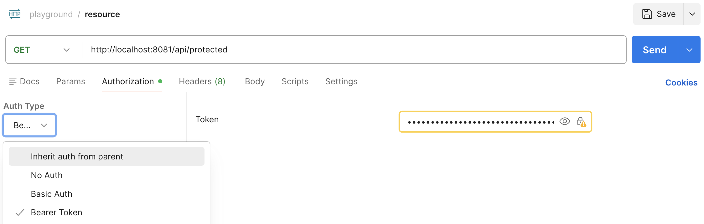

# Exercise: Implementing the BFF Pattern (light version) with JWT Authentication

In this exercise, you will implement the Backend for Frontend (BFF) pattern using JWT authentication.

You will in the end have a frontend that communicates with a backend using session cookies, and the backend will communicate with a downstream API using JWT tokens.

## Setup

1. Fork this [repository](https://github.com/ek-osnb/spring-security-jwt-starter) to your GitHub account.
2. Clone the repository to your local machine.
3. Open the project in IntelliJ IDEA.
4. Start the applications using Docker Compose:

    ```bash
    docker compose up -d
    ```
    > This will start an nginx container that will act as a reverse proxy for the frontend and backend applications, to make both applications accessible at `http://localhost`.

## Exercise 1: Implementing the BFF pattern

You will implement the BFF pattern by creating a backend application that issues JWT on behalf of the authenticated user and uses these tokens to communicate with a downstream resource server.

### Step 1: Adding dependency to the BFF
1. Add the following dependency to your `pom.xml` file:
```xml
<dependency>
    <groupId>org.springframework.security</groupId>
    <artifactId>spring-security-oauth2-jose</artifactId>
</dependency>
```

### Step 2: Create RSA key pair
Create a RSA key pair for signing and validating JWT tokens.

Navigate to the `bff` directory and create a new directory called `keys`. Inside the `keys` directory (`cd` into `keys` directory) use the following commands to generate a RSA key pair:

**Generate a keypair:**
```bash
openssl genrsa -out keypair.pem 2048
```
**Extract the public key:**
```bash
openssl rsa -in keypair.pem -pubout -out public.pem
```
**Extract the private key:**
```bash
openssl pkcs8 -topk8 -inform PEM -outform PEM -nocrypt -in keypair.pem -out private.pem
```
**Remove the original keypair file:**
```bash
rm keypair.pem
```

### Step 3: Loading the RSA keys in Spring Boot
Inside the `bff` app, create a new class inside the `security` package called `RsaKeyProperties` and add the following code to load the RSA keys from the `keys` directory:

```java
@ConfigurationProperties(prefix = "rsa")
public record RsaKeyProperties(RSAPublicKey publicKey, RSAPrivateKey privateKey) {
}
```

Enable configuration properties in the main application class by adding the `@EnableConfigurationProperties` annotation:

```java
@SpringBootApplication
@EnableConfigurationProperties(RsaKeyProperties.class)
public class BffApplication {
    // ...
}
```

Add the following properties to your `application.properties` file to specify the location of the RSA keys:

```properties
rsa.public-key=file:keys/public.pem
rsa.private-key=file:keys/private.pem
```

### Step 4: Creating a JWT encoder
Inside the `SecurityConfig` class, create a bean for the JWT encoder that uses the RSA keys to sign the tokens:

```java
@Bean
JwtEncoder jwtEncoder(RsaKeyProperties rsaKeyProperties) {
    JWK jwk = new RSAKey.Builder(rsaKeyProperties.publicKey())
            .privateKey(rsaKeyProperties.privateKey())
            .keyID("my-key-id")
            .build();
    JWKSource<SecurityContext> jwks = new ImmutableJWKSet<>(new JWKSet(jwk));
    return new NimbusJwtEncoder(jwks);
}
```

This bean will be used to encode JWT tokens with the RSA private key.

### Step 5: Creating a JWT token generator
Create a new class called `JwtTokenGenerator` in the `security` package and add the following code to generate JWT tokens:

```java
@Service
public class JwtTokenGenerator {
    private final JwtEncoder jwtEncoder;

    public JwtTokenGenerator(JwtEncoder jwtEncoder) {
        this.jwtEncoder = jwtEncoder;
    }

    public String generate(Authentication authentication) {
        Instant now = Instant.now();
        long expiry = 20L; // Token expiry time in seconds

        String subject = authentication.getName();

        List<String> authorities = authentication.getAuthorities().stream()
                .map(GrantedAuthority::getAuthority)
                .toList();

        if (authorities.isEmpty()) {
            authorities = List.of("ROLE_USER");
        }

        JwtClaimsSet claims = JwtClaimsSet.builder()
                .issuer("self")
                .issuedAt(now)
                .expiresAt(now.plus(expiry, ChronoUnit.SECONDS))
                .subject(subject)
                .claim("authorities", authorities)
                .build();

        JwsHeader jwsHeader = JwsHeader.with(SignatureAlgorithm.RS256)
                .keyId("my-key-id")
                .build();
        return this.jwtEncoder.encode(JwtEncoderParameters.from(jwsHeader, claims)).getTokenValue();
    }
}
```
This class will be used to generate JWT tokens for authenticated users.

**Notice that the we have hard coded `my-key-id` as the key ID in the JWT header, which matches the key ID we set in the `JwtEncoder` bean. Externalize this to a property in `application.properties` and update the code accordingly by using `@Value` to inject the property value.**

### Step 6: Create a JWK discovery endpoint
A JWK discovery endpoint is used to expose the public keys that can be used to verify the JWT tokens. This is typically done at the `/.well-known/jwks.json` endpoint.

Create a new class called `JwkSetEndpointController` in the `security` package and add the following code to expose the JWK discovery endpoint:

```java
@RestController
class JwkSetEndpointController {
    private final RsaKeyProperties rsaKeyProperties;

    JwkSetEndpointController(RsaKeyProperties rsaKeyProperties) {
        this.rsaKeyProperties = rsaKeyProperties;
    }

    @GetMapping("/.well-known/jwks.json")
    public ResponseEntity<Map<String, Object>> jwks() {
        RSAPublicKey publicKey = rsaKeyProperties.publicKey();

        RSAKey rsaKey = new RSAKey.Builder(publicKey)
                .keyID("my-key-id")   // should match the JWT header kid
                .algorithm(JWSAlgorithm.RS256)
                .keyUse(KeyUse.SIGNATURE)
                .build();

        Map<String, Object> body = new JWKSet(rsaKey).toJSONObject();

        return ResponseEntity.ok(body);
    }
}
```
Note that the `keyID` in the JWK must match the `keyID` used in the JWT header when encoding the token. Refactor to load the `keyID` from a property in `application.properties` and inject it using `@Value` to ensure consistency across the application.

### Step 7: Making the jwks endpoint public

Update the security filter chain configuration in the `SecurityConfig` class to allow unauthenticated access to the JWK discovery endpoint. Update the `authorizeHttpRequests` configuration to permit all requests to the `/.well-known/jwks.json` endpoint:


## Exercise 2: Securing the Resource Server
In this exercise, you will secure the resource server to validate the JWT tokens issued by the BFF.

### Step 1: Adding dependencies
Add the following dependencies to your `pom.xml` file in the `resource-server` module:
```xml
<dependency>
    <groupId>org.springframework.boot</groupId>
    <artifactId>spring-boot-starter-oauth2-resource-server</artifactId>
</dependency>
```
This will add the necessary dependencies for securing the resource server with JWT tokens issued by the BFF.

### Step 2: Configuring the resource server
In the `ResourceServerConfig` class, add the following configuration to set up the resource server to validate JWT tokens:
```java
@Configuration
public class SecurityConfig {
    @Bean
    SecurityFilterChain securityFilterChain(HttpSecurity http) throws Exception {
        http
                .authorizeHttpRequests(auth -> auth
                        .anyRequest().authenticated()
                )
                .oauth2ResourceServer(oauth2 -> oauth2
                        .jwt(Customizer.withDefaults())
                )
                // Return 401 instead of redirecting to /login
                .exceptionHandling(eh -> eh
                        .authenticationEntryPoint((req, res, ex) -> res.sendError(HttpServletResponse.SC_UNAUTHORIZED))
                );
        return http.build();
    }
}
```
This configuration sets up the resource server to validate JWT tokens and return a 401 Unauthorized response if the token is invalid or missing.

### Step 3: Adding discovery endpoint URL
Add the following property to your `application.properties` file in the `resource-server` module to specify the URL of the JWK discovery endpoint exposed by the BFF:
```properties
spring.security.oauth2.resourceserver.jwt.jwk-set-urI=http://localhost:8080/.well-known/jwks.json
```

This property tells the resource server where to find the public keys for validating the JWT tokens issued by the BFF.


## Exercise 3: Calling the resource server with JWTs and `RestClient`
In this exercise, you will call the resource server from the BFF using the `RestClient` and include the JWT token in the request.

### Step 1: Adding `RestClient` dependency
Add the following dependency to your `pom.xml` file in the `bff` module:
```xml
<dependency>
    <groupId>org.springframework.boot</groupId>
    <artifactId>spring-boot-starter-restclient</artifactId>
</dependency>
```
This will add the necessary auto-configuration for using the `RestClient`.

### Step 2: Setting up RestClient
Inside the `bff` application, create a new package called `clients` and inside create a new class called `RestClientConfig` with the following code to set up the `RestClient`:
```java
@Configuration
public class RestClientConfig {
    @Bean
    @Qualifier("resourceServerClient")
    RestClient resourceServerClient(RestClient.Builder builder) {
        return builder
                .baseUrl("http://localhost:8081") // URL of the resource server
                .build();
    }
}
```

The `@Qualifier` annotation is used to distinguish this `RestClient` bean from any other `RestClient` beans that may be defined in the application in the future.

### Step 3: Creating a client for the resource server
Create a new class called `ProtectedClient` in the `clients` package with the following code to call the resource server and include the JWT token in the request:
```java
@Service
public class ProtectedClient {
    private final RestClient restClient;

    public ProtectedClient(@Qualifier("resourceServerClient") RestClient restClient) {
        this.restClient = restClient;
    }

    public record ProtectedDto(String message) {
    }

    public ProtectedDto getProtectedData(String jwtToken) {
        return this.restClient.get()
                .uri("/api/protected")
                .header(HttpHeaders.AUTHORIZATION, "Bearer " + jwtToken)
                .retrieve()
                .body(ProtectedDto.class);
    }
}
```
In this code, we are using the `RestClient` to make a GET request to the `/api/protected` endpoint of the resource server. We include the JWT token in the `Authorization` header of the request using the Bearer token scheme.

### Step 4: Creating a controller
Inside the `bff` application, create a new controller called `ProtectedController` in the `controller` package with the following code to expose an endpoint that calls the resource server:
```java
@RestController
@RequestMapping("/api/protected")
class ProtectedController {
    private static final Logger log = LoggerFactory.getLogger(ProtectedController.class);
    private final ProtectedClient protectedClient;
    private final JwtTokenGenerator jwtTokenGenerator;

    ProtectedController(ProtectedClient protectedClient, JwtTokenGenerator jwtTokenGenerator) {
        this.protectedClient = protectedClient;
        this.jwtTokenGenerator = jwtTokenGenerator;
    }

    @GetMapping
    ProtectedClient.ProtectedDto getProtectedData(Authentication authentication) {
        String jwtToken = jwtTokenGenerator.generate(authentication);
        log.debug("Generated token for user {}: {}", authentication.getName(), jwtToken);
        return protectedClient.getProtectedData(jwtToken);
    }
}
```
In this controller, we have an endpoint at `/api/protected` that generates a JWT token for the authenticated user and then calls the `ProtectedClient` to get the protected data from the resource server using the generated JWT token.

### Step 5: Add the authenticated user to the Protected Endpoint
Navigate to the `resource` module and update the `ProtectedController` to include the `Authentication` object as a parameter in the `getProtected` method. This will allow you to access the authenticated user's information in the resource server.

Replace this
```java
@GetMapping
public ProtectedResponse getProtected() {
    return new ProtectedResponse(String.format("Hello %s - This is a protected resource!", "ANONYMOUS"));
}
```
with this
```java
@GetMapping
public ProtectedResponse getProtected(Authentication authentication) {
    String username = authentication.getName();
    return new ProtectedResponse(String.format("Hello %s - This is a protected resource!", username));
}
```

## Exercise 4: Testing the implementation

Test the application by starting both the BFF and the resource server.


## Exercise 5: Inspecting the JWT token
You can use a tool like [jwt.io](https://jwt.io/) to inspect the JWT token generated by the BFF. Copy the token from the debug logs and paste it into the JWT debugger on jwt.io to see the header, payload, and signature of the token. Verify that the token contains the expected claims and that the signature is valid using the public key from the JWK discovery endpoint.

### Step 1: Enable debug logging
To see the generated JWT token in the logs, you can enable debug logging for the `JwtTokenGenerator` class. Add the following line to your `application.properties` file in the `bff` module:
```properties
logging.level.your.package.name.JwtTokenGenerator=DEBUG
```
Make sure to replace `your.package.name` with the actual package name where the `JwtTokenGenerator` class is located.

### Step 2: Generate a JWT token
Use the frontend to login and access the protected endpoint. This will trigger the generation of a JWT token, which will be logged in the debug logs. Look for a log entry that contains the generated token, which should look something like this:
```bash
DEBUG your.package.name.JwtTokenGenerator - Generated token for user username: eyJhbGciOiJSUzI1Ni....
```
### Step 3: Inspect the token
Copy the JWT token from the logs and paste it into the JWT debugger on [jwt.io](https://jwt.io/) to inspect the contents of the token.

### Step 4: Verify the signature
Access the JWK discovery endpoint at `http://localhost:8080/.well-known/jwks.json` to get the public key used for signing the JWT tokens. Only copy the object inside the `keys` array that has the matching `kid` (key ID) as the one used in the JWT header. Use this public key to verify the signature of the JWT token in the JWT debugger.


### Step 5: Using Postman to test the protected endpoint
Extract the JWT token from the logs and use it in Postman to make a request to the protected endpoint of the resource server. Set the `Authorization` header to `Bearer <your-jwt-token>` and send a GET request to `http://localhost:8081/api/protected`. You should receive a response from the resource server if the token is valid otherwise you will receive a `401 Unauthorized` response.



### Step 6 (**optional**): Using `curl` to test the protected endpoint
You can also use `curl` to test the protected endpoint. Use the following command, replacing `<your-jwt-token>` with the actual JWT token you extracted from the logs:
```bash
curl -H "Authorization: Bearer <your-jwt-token>" http://localhost:8081/api/protected
```
> Note that there is a space between the `Bearer` keyword and the token.

If the token is valid, you should receive a response from the resource server. If the token is invalid or missing, you will receive a `401 Unauthorized` response.


## Reflection questions
1. What are the benefits of using the BFF pattern with JWT authentication?
2. What are the potential security risks of using JWTs and how can they be mitigated?
3. How does the resource server know how to validate the JWT tokens issued by the BFF?
4. How does the JWK discovery endpoint work and why is it important in this architecture?

## References
- [Spring Security Reference - OAuth2 Resource Server](https://docs.spring.io/spring-security/reference/servlet/oauth2/resource-server/index.html)
- [Spring Security Reference - JWT Support](https://docs.spring.io/spring-security/reference/servlet/oauth2/resource-server/jwt.html)
- [Backend for Frontend (BFF) pattern](https://auth0.com/blog/the-backend-for-frontend-pattern-bff/)